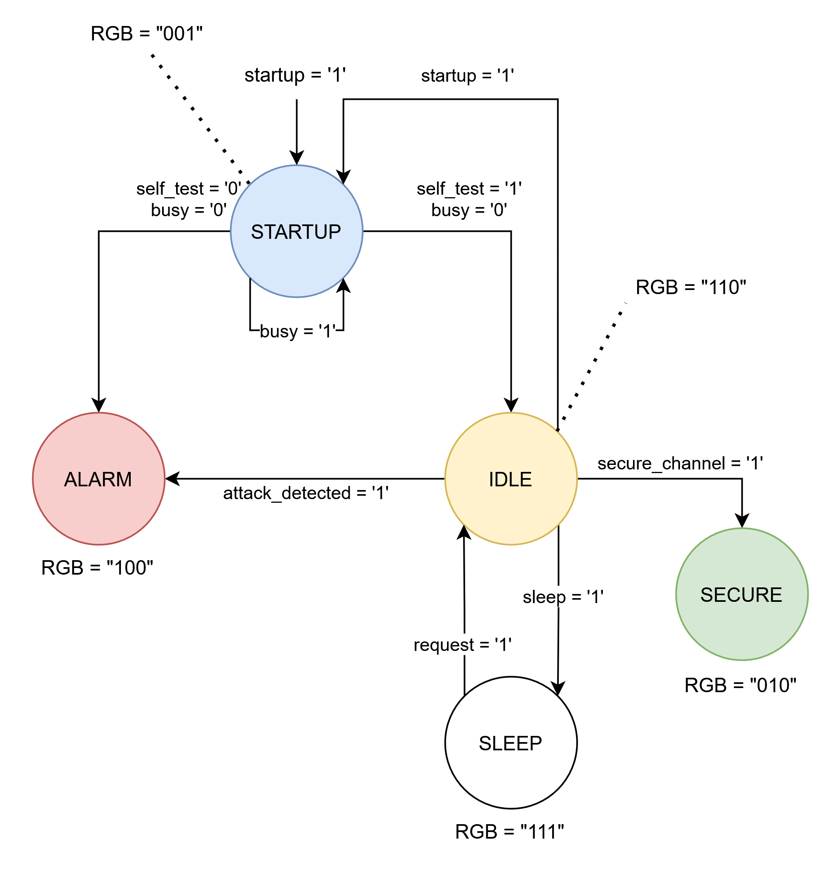

# ECE 410 Prelab 2: Finite State Machines

Name: Dion Walton

CCID: ddwalton

Student Number: 1761090

Email: ddwalton@ualberta.ca

Lab Section: D31

## Part 1: List of Finite State Machines (FSMs)

Plenty of real-world applications use FSMs, as they mathematically describe the states of operation, functions/outputs in those states, and conditions to move between them. A list of 5 applications that use state machines can be seen below:

1. Unmanned autonomous vehicle flight modes (Position mode, safe recovery mode, offboard control mode, etc.)
2. Vending machines (Get payment, fetch product)
3. Computer instruction cycles (Fetch, decode, execute)
4. Students (Eat, sleep, do schoolwork)
5. Traffic lights (Red/green, yellow/red, green/red, flashing red)

## Part 2: Pseudo-Random Number Generator Block Diagram

## Part 3: Secure Element Chip FSM State Diagram

The following is the state diagram for the FSM of the secure element chip, a Moore machine was chosen as more appropriate way of modelling the given task, as the output `RGB[2:0]` bit vector is dependent only the current state, and not dependent on any of the inputs at the same time. A Mealy machine does not feedforward the inputs to the combinational block determining the outputs, the inputs only determine the state-to-state transitions.

