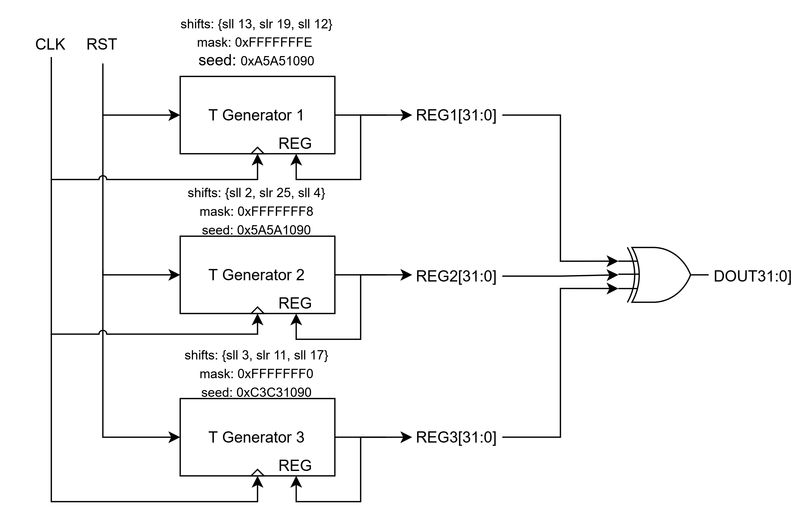

# ECE 410 Prelab 2: Finite State Machines

Name: Dion Walton

CCID: ddwalton

Student Number: 1761090

Email: ddwalton@ualberta.ca

Lab Section: D31

## Part 1: List of Finite State Machines (FSMs)

Plenty of real-world applications use FSMs, as they mathematically describe the states of operation, functions/outputs in those states, and conditions to move between them. A list of 5 applications that use state machines can be seen below:

1. Unmanned autonomous vehicle flight modes (Position mode, safe recovery mode, offboard control mode, etc.)
2. Vending machines (Get payment, fetch product)
3. Computer instruction cycles (Fetch, decode, execute)
4. Students (Eat, sleep, do schoolwork)
5. Traffic lights (Red/green, yellow/red, green/red, flashing red)

## Part 2: Pseudo-Random Number Generator Block Diagram
> Draw a block diagram for the top-level entity of the pseudo-random number generator from Part 1.

## Part 3:
> Draw the state diagram representing a Finite State Machine (FSM) for the secure element chip from Part 2, clearly showing the transitions between states along with their input and output conditions. Decide whether a Mealy or Moore FSM is more appropriate for this model, and briefly justify your choice.